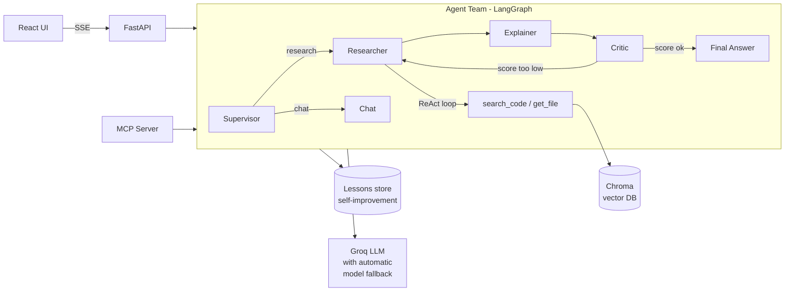

# CodeAtlas

**An AI team that reads a GitHub repository and answers questions about it — with citations you can check, and answers that get better over time.**

Ask "How are retries handled?" about any indexed repo. A team of agents (built with LangChain and LangGraph) searches the actual code, reads it, writes an answer, and has a second agent check that answer against the evidence before you see it. The whole thing runs on free-tier infrastructure.

## Why this exists

Most portfolio RAG projects are "upload a PDF, ask a question." This one is deliberately harder: it demonstrates hybrid retrieval, a real multi-agent pipeline with a self-critique loop, a working self-improvement mechanism, an MCP server other AI tools can plug into, and a measured evaluation — not just a demo that looks good once.

## Architecture



**The pipeline for one question:**
1. **Supervisor** — routes the question (is this about the repo's code, or just a greeting?)
2. **Researcher** — a hand-built ReAct agent: searches the code (hybrid: vector similarity + BM25 keyword search), reads files, decides when it has enough evidence
3. **Explainer** — turns the Researcher's findings into a clear, cited answer
4. **Critic** — independently scores the answer against the actual evidence (1-5); a low score sends it back for one retry with specific feedback
5. **Lessons** — when a retry was needed and then succeeded, what worked gets saved; future similar questions get that as a hint (self-improvement without retraining anything)

## Tech stack

| Piece | Choice | Why |
|---|---|---|
| Agents | LangGraph + LangChain | Explicit control over the ReAct loop and multi-agent routing |
| LLM | Groq (`openai/gpt-oss-120b`, with automatic fallback) | Free tier, fast inference |
| Vector DB | Chroma | Local, free, no server to run |
| Search | Hybrid: sentence-transformers embeddings + BM25 (`rank-bm25`) | Catches both "retry logic" (concept) and "HTTPAdapter" (exact name) |
| Code parsing | Python `ast` | Chunks by function/class instead of arbitrary line windows |
| Backend | FastAPI, Server-Sent Events | Streams agent progress live to the browser |
| Frontend | React (Vite) | No framework bloat |
| Protocol | MCP (Model Context Protocol) | Other AI tools (Claude Desktop, MCP Inspector) can use CodeAtlas as a tool |
| Eval | Custom harness, 14-question set | Routing accuracy, critic score, citation accuracy, self-improvement delta |

## Quick start

**Backend:**
```bash
cd backend
python -m venv .venv
.venv\Scripts\activate.bat        # Windows; use source .venv/bin/activate on Mac/Linux
pip install -r requirements.txt
cp .env.example .env              # then add your free Groq API key from console.groq.com
python -m app.indexing.indexer index https://github.com/psf/requests
uvicorn app.main:app --reload
```

**Frontend** (separate terminal):
```bash
cd frontend
npm install
npm run dev
```
Open the URL Vite prints, pick `requests` from the left rail, and ask a question.

**Try the MCP server:**
```bash
cd backend
python scripts/mcp_client_demo.py requests "How are retries handled?"
```

## Evaluation results

Measured on a 14-question set against `psf/requests` (10 code questions + 4 routing/chat checks), on `openai/gpt-oss-120b`:

| Metric | Result |
|---|---|
| Routing accuracy | 100% |
| Avg. Critic score | 4.6-4.8 / 5 |
| Needed a retry | 0-25%, run-dependent |
| Cited the correct file | 80% (after fixing a ground-truth error and a citation-format bug — see below) |
| Mentioned the correct file (any format) | 90-100% |

Reproduce it:
```bash
python -m eval.run_eval requests
python -m eval.compare_lessons requests   # measures the self-improvement effect specifically
python -m eval.make_chart requests        # renders a before/after chart
```

### Self-improvement, measured

`compare_lessons.py` runs the same questions twice: once with lessons cleared, once immediately after (so any lessons saved during the first pass are available). One real run showed retries dropping from 20% to 0% and the average Critic score rising from 4.70 to 5.00 — see `eval/results/requests-lesson-comparison.png`.

## Known limitations (found by actually checking the work, not guessing)

- **Citation format varies.** The Explainer sometimes writes `file.py lines 123-456` instead of `file.py:123-456`; the eval's extractor was updated to catch both, but a still-rarer "file name and line number separated by unrelated prose" pattern isn't caught. See `eval/harness.py`.
- **A same-named-method mixup.** In one answer, the agent correctly identified `Session.send` handles the `verify` parameter, but cited a same-named abstract stub method instead of the real implementation ~600 lines later in the same file. Name-based search doesn't disambiguate multiple symbols sharing a name.
- **Paraphrased questions can get a thinner answer.** The same underlying question asked in different words sometimes leads the Researcher to under-explore compared to the original phrasing, even though the answer given is still accurate.
- **Free-tier daily token quotas are real and tight.** `openai/gpt-oss-120b` and `openai/gpt-oss-20b` each get a separate 200K-token/day budget on Groq's free tier. CodeAtlas automatically falls back across a chain of models when one is exhausted (`app/agents/llm.py`) and clearly reports the switch, but an eval run split across models mid-run is a real, disclosed constraint of building on free infrastructure, not a hidden one.
- **Reasoning models have hidden costs.** `openai/gpt-oss-120b` generates internal "thinking" tokens that count against quota even for a trivial prompt — a plain 1-token diagnostic probe is not actually free to run against it.
- **The self-improvement comparison is currently inconclusive.** `eval/results/requests-lesson-comparison.png` shows a before/after run where lessons produced no improvement, and slightly worse results on two of three metrics:

  

  This specific run isn't trustworthy evidence either way: it had a small sample (4 vs. 8 fully-scored questions, since the BEFORE pass hit the daily quota early), a model change mid-experiment (from `gpt-oss-20b` to `qwen-3.8-27b` as the day's quota shifted), and unusually heavy free-tier rate-limiting throughout. A controlled re-test — one model, full sample, run when quota is fresh — is needed before drawing a real conclusion about whether the lessons mechanism helps. Earlier, smaller-scale tests during development (see project history) did show a clear reduction in retries once a lesson existed; this larger run is the one that should be trusted going forward once it's clean.

## Project structure

```
backend/
  app/
    agents/       # LangGraph team: supervisor, researcher (ReAct), explainer, critic, model fallback
    api/          # FastAPI routes (SSE streaming, feedback, repo indexing)
    indexing/     # Clone -> chunk (by function/class) -> embed -> store
    memory/       # Self-improvement "lessons" store
    tools/        # Hybrid search, safe file reading
    mcp_server.py # Exposes the same capabilities over MCP
  eval/           # Question set, scoring harness, before/after comparison, charting
frontend/
  src/            # React UI: repo picker, chat, live agent trace log
```

## Deployment

**Test the production container locally first:**
```bash
docker compose up --build
```
This builds the React frontend, packages it with the FastAPI backend into one image, and serves everything from `http://localhost:7860`. On first boot it automatically pre-indexes `psf/requests` so there's something to try immediately. You still need `backend/.env` with your `GROQ_API_KEY` — `docker-compose.yml` reads it at container start (it is never baked into the image; see `.dockerignore`).

**Deploy to Hugging Face Spaces (free):**
1. Create a new Space → SDK: **Docker**.
2. Push this repo to it (`git remote add space <your-space-git-url>`, `git push space main`).
3. In the Space's **Settings → Repository secrets**, add `GROQ_API_KEY`.
4. That's it — Spaces builds the `Dockerfile` automatically and exposes the app on port 7860.

**Known constraint:** HF Spaces' free storage is ephemeral — an indexed repo (in `data/`) doesn't survive a Space restart. The entrypoint script re-indexes the demo repo automatically on every fresh boot to work around this; a visitor indexing their own repo will need to re-index if the Space restarts. A persistent volume removes this limitation but isn't part of the free tier.

## What I'd build next

- Multimodal support: index architecture diagrams and screenshots in a repo's docs (CLIP embeddings), not just text
- Disambiguate same-named symbols in search results (the `Session.send` issue above)
- Persistent storage so an indexed repo survives a Space restart

## License

MIT
